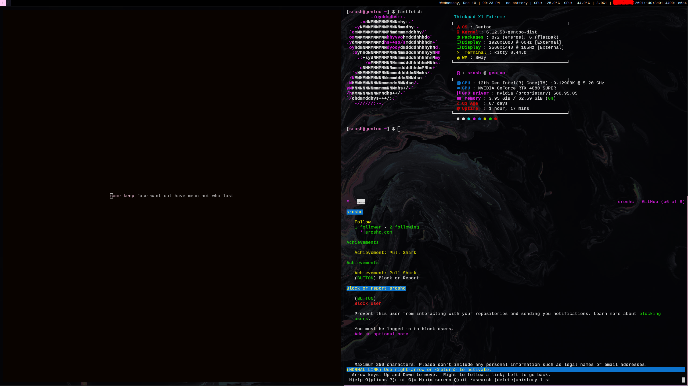

# dot-files

My dot-files for my sway setup alongside some other utilities like mpv, kitty, fastfetch. etc. 

Requirements are in `requirements.txt`, `check_requirements.sh` should check if you have all them.

`install.sh` should install all the configs and ask you if you want to replace anything if a configuration is present.

 

> Border padding was invented by monitor companies to sell more monitors
